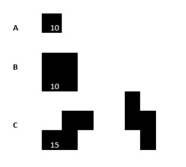
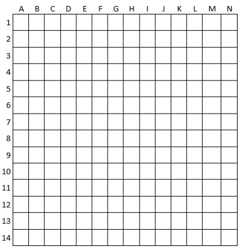
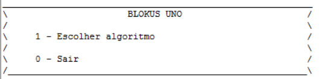
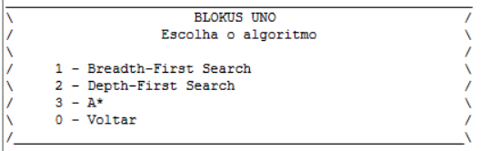
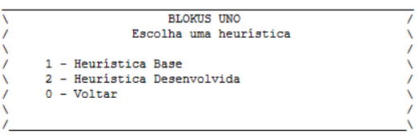

# Manual de Utilizador - Blokus Duo

## Inteligência Artificial - Projeto 2

Grupo:

- André Serrado 201900318

- Gabriel Pais 201900301

Docente:

- Filipe Mariano

Este manual de utilizador visa facilitar o compreensão do problema apresentado, e por consequência facilitar também a sua resolução. O projeto teve como principal objetivo, a procura de soluções para os tabuleiros pré-fabricados, recorrendo à utilização de algoritmos de procura. Este projeto foi também desenvolvido, exclusivamente com a linguagem Lisp.

## Índice

- [Objetivo do Jogo](#objetivo-do-jogo)
- [Regras](#regras)
- [Descrição Geral](#descricao-geral)
- [Informação Necessária](#informacao-necessaria)
- [Informação reduzida](#informacao-reduzida)
- [Limitações do Programa](#limitacoes-do-programa)

---

## [Objetivo do Jogo](#Objetivo-do-jogo)

No presente projeto, tal como na 1º fase do Projeto, desenvolvida anteriormente, vamos considerar uma versão simplificada do jogo **_Blokus_**, agora denominada de **_Blokus Duo_**.

Nesta fase o objetivo é possibilitar a jogabilidade entre 2 jogadores, tendo em conta o conhecimento adquirido no âmbito da _Teoria de Jogos_.


## [Regras](#regras)

- O jogo será disputado entre 2 jogadores.

- Existem 35 peças de três tipos para cada jogador.

- O tabuleiro terá um tamanho 14x14, 14 linhas e 14 colunas, sem existência de tabuleiros pré-preenchidos.

- Os jogadores escolhem uma das peças disponíveis e colocam-as de modo a que um dos quadrados da peça preencha um dos quadrados de canto do tabuleiro do jogo (posição inicial), sendo que o **Jogador 1** deverá iniciar no canto superior esquerdo e o **Jogador 2** no canto inferior direito.

- Uma vez colocada, a posição da peça não poderá ser alterada até ao final do jogo.

- As jogadas são feitas à vez e, em cada turno, o jogador coloca uma peça de modo a que toque pelo menos numa das suas peças já existentes, mas apenas nos cantos. **Peças do mesmo jogador nunca se podem tocas nas laterais, mas podem tocar lateralmente com peças do outro jogador**.

- Quando um dos jogadores não consegue colocar uma peça no tabuleiro do jogo, deverá passar a vez.

- O jogo termina quando nenhum dos jogadores consegue colocar mais peças.

- Quando o jogo termina, os jogadores contam o número de quadrados existentes nas peças que restaram, e o jogador que tiver o menor número de quadrados é o vencedor.

## [Descrição Geral](#descricao-geral)

### [Principais diferenças](#principais-diferencas)

- Em blokus Uno existe apenas um jogador. Para efeitos de melhor compreensão, este jogador serão os métodos de procura desenvolvidos.

- O jogo, habitualmente, termina quando todas as peças tiverem sido colocadas ou não for possível colocar mais peças respeitando as regras.

- Tendo isto, para esta variante do jogo estarão disponíveis 10 peças do tipo "A", 10 do tipo B e 15 do tipo c-1 e c-2 em conjunto.



### [Funcionamento Geral](#funcionamento-geral)

- O número 0 para casas vazias
- O número 1 para casas ocupadas com peças
- O número 2 para casas bloqueadas

  

As peças não podem estar adjacentes umas às outras, e deve existir pelo menos uma de um certo tipo para poder ser inserida.


---

### Tabuleiros Disponíveis e objetivos

#### Problema-a - objetivo 8 casas preenchidas


---

#### Problema-b - objetivo 20 casas preenchidas

## 

#### Problema-c - objetivo 28 casas preenchidas

## 

#### Problema-d - objetivo 36 casas preenchidas

## 

#### Problema-e - objetivo 44 casas preenchidas


---

#### Problema-f - objetivo 72 casas preenchidas

## 

## [Informação produzida](#ecrã-teclado-e-ficheiros)

Inicialmente será apresentado um menu de interação com o utilizador. Para começar o programa deverão ser lidas e seguidas as instruções de [Limitacoes do Programa](#limitacoes-do-programa) e, apenas após poderá ser inserido o comando:

```lisp
(start)
```



!




Após a execução do programa será criado um ficheiro ".dat" com o output do mesmo. Este ficheiro de output terá no seu conteúdo as soluções do problema executado bem como as suas estatísticas.

## [Limitacoes do Programa](#limitacoes-do-programa)

Para que o projeto produza o resultado pretendido, todos os ficheiros .lisp diponibilizados deverão ser executados. Além disso, é ainda necessário que o "path" para os ficheiros seja alterado para que estes sejam compilados com sucesso! Este "path" pode ser encontrado no ficheiro _projeto.lisp_.
